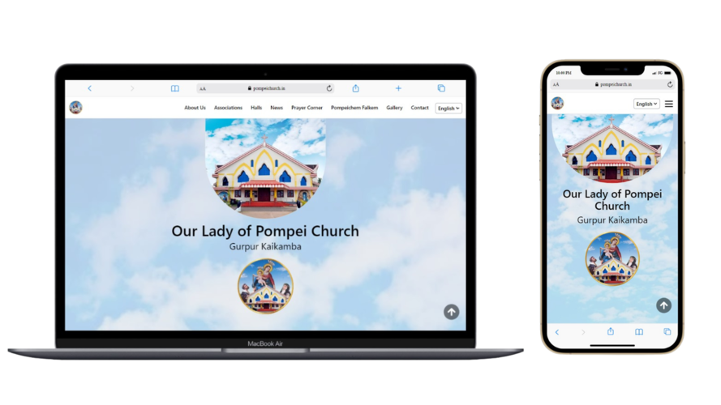

# Our Lady of Pompei Church Gurpur Kaikamba ⛪✝️

 This project, [pompeichurch.in](https://pompeichurch.in/) is a labor of love, designed to keep parishioners and visitors informed about everything happening in our church right at their fingertips.

 
 

## Key Features

With comprehensive information about the church since its inception, we aim to share current affairs through a dedicated events webpage and offer heartfelt tributes to parishioners who have departed for their heavenly abode. Mass Timings helps one to plan their spiritual journey effortlessly. Sections for Wards, Associations, Halls, Convents, and Institutions and much more!

## Highlights That Set Us Apart

✨ Bilingual Support (Konkani and English)
✨ Prayer Corner
✨ Upcoming Events
✨ Rich Gallery

## 🚀 Getting Started

*To get [pompeichurch.in](https://pompeichurch.in/) on your local machine follow the steps given below :*

### 1. Clone the Repository

First, you'll need to clone the repository to your local machine. Open your terminal and run the following command:

```bash
git clone https://github.com/nigelperis/pompeichurch-website.git
```

# For astro - frontend

### 2. Navigate to the Frontend Directory

Change your directory to the frontend folder:

```bash
cd astro-frontend
```

### 3. Install Dependencies

Make sure you have all the necessary dependencies installed. You can use the following command:

```bash
bun install
```

### 4. Run the Project

Now, you can run the project on your localhost. Use the following command:

```bash
bun dev
```

Once the development server starts, the application will typically be available at http://localhost:3000 (or another port if specified). You can Ctrl+click on the link to open it in your browser.

# For strapi - backend

### 2. Navigate to the Backend Directory

Change your directory to the backend folder:

```bash
cd strapi-backend
```

### 3. Install Dependencies

Install the required dependencies for the backend.  You can use the following command:

```bash
pnpm i
```

### 4. Configure Environment Variables

Create a `.env` file based on the [`.env.example`](strapi-backend/.env.example) file.

### 5. Run the Project

Start the backend server on your localhost:

```bash
pnpm run develop
```

Once the server is running, it will be available at http://localhost:1337 (or another port if specified). You can Ctrl+click on the link to open it in your browser.

## ⚙️ Technologies Used

This project utilizes the following technologies:

- **Framework**: [Astro](https://astro.build/) 🌟
- **Styling**: [Tailwind CSS](https://tailwindcss.com/) 🎨
- **CMS**: [Strapi](https://strapi.io/) 🛠️
- **Database**: [PostgreSQL](https://www.postgresql.org/) 🗂️
- **Deployment**: [Hostinger](https://www.hostinger.com/) 🚀
- **Analytics**: [Google Analytics](https://developers.google.com/analytics) + [Microsoft Clarity](https://clarity.microsoft.com/) 💡

## 👀 Explore our site [pompeichurch.in](https://pompeichurch.in/)

This website is more than just a digital presence; it’s a step towards making church life more accessible to everyone, everywhere. 😀

## 📜 License
This project is licensed under the [MIT License](LICENSE).

